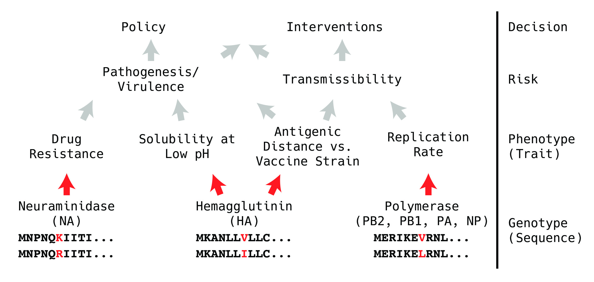
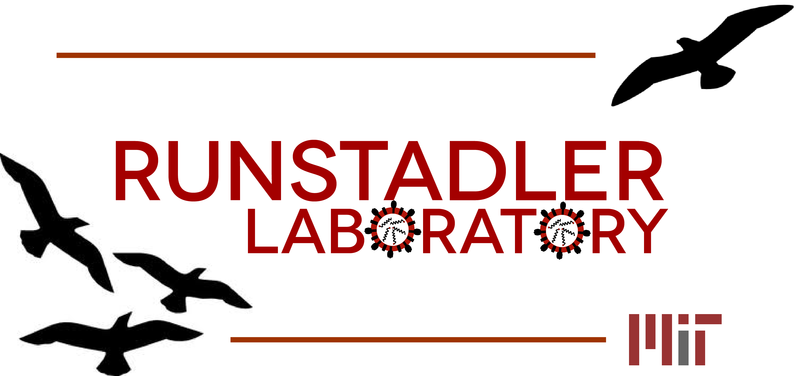

# Bio

> - Final year PhD candidate at MIT Biological Engineering
> - Computational disease ecology and applied machine learning
> - On a mission to make disease surveillance a **quantitative** and **predictive** endeavour.

# Phenotypic Interpretation

##

{#fig .class height="350px"}

## The Need

> 1. Drug resistance data matched with protein sequences.
> 1. Prediction system capable of delivering interpretable insights.
> 1. A model-guided feedback loop for improving predictions and guiding pre-emptive testing.

## Proposed Solutions

> 1. High Throughput Robotic Viral Phenotyping
> 1. Interpretable Machine Learning Systems
> 1. Generative Mapping of Sequence-Fitness Landscapes

# Aim 1: HT Viral Phenotyping

## Big Goal

Biochemically **phenotype** every **viral protein** variant sampled

## Scoped Goal

Determine **drug resistance** of every **influenza neuraminidase** variant sampled

## Required Components

## Rational Protein Library Generation

## High Throughput Cloning

## High Throughput Phenotyping

# Aim 2: Interpretable Geno-Pheno

## Big Goal

Deploy **machine learning** algorithms to interpretably learn **phenotype from genotype**.

## Scoped Goal

Demonstrate utility of **graph convolutions** for interpretably learning **drug resistance from systematic measurements**.

## Graph Convolutions

## Protein Structure Graphs

- Protein structure represented as graphs
    - Nodes: Amino acids
    - Edges: Biochemical interactions

## Graph Convolutions Enable Data Introspection

# Aim 3: Generative Embeddings

## Big Goal

Map fitness landscape of **every viral protein** w.r.t. **quantitative phenotype**.

## Scoped Goal

Map fitness landscape of every **neuraminidase** w.r.t **drug resistance phenotype**.

## Fitness Mappings from Variational Autoencoders

## Potential Uses

> - Mapping drug resistance vs. sequence landscapes
> - Intelligently navigate evolvable protein search space
> - Pre-emptive testing for drug resistance

# Vision

# Acknowledgments

{#fig .class width="400px"}

- Jonathan A. Runstadler, PhD, DVM (MIT)
- Mark Bathe, PhD (MIT)
- Jukka-Pekka Onnela, PhD (HSPH)
- David K. Duvenaud (Harvard, U Toronto)
- Islam T. Hussein, PhD, DVM (MIT)
- Nichola J. Hill, PhD (MIT)
